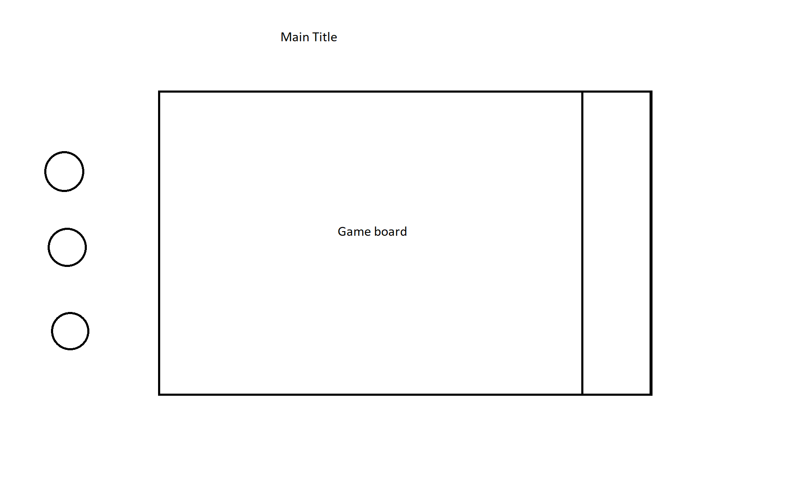

## Background
---
Food wars is a spin on the classic game pinball 3D, featuring numerous food items on the pinball board.

## Functionality & MVP
---
In food wars, the player will be able to
- [ ] Launch ball to begin game
- [ ] Physics to handle bounces off of walls and keeps track of when a player has lost
- [ ] Score system to keep track of a player's score

## Wireframes
---

## Architecture and Technologies
---
This project will be implemented with the following techologies
- `Javascript` for game logic
- `Canvas` for rendering on screen
- `Webpack` to bundle js files

Will contain scripts to simulate physics within game

## Implementation Timeline
---
- **Day 1**: Setup project; package.json, webpack config, install any required dependencies
- **Day 2**: Implement functions to simulate physics
- **Day 3**: Render objects on screen and give them physics effects
- **Day 4 & 5**: Find sprites for objects on screen and touch up any details